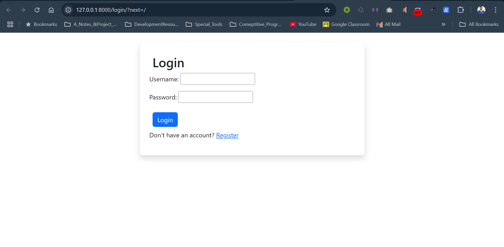
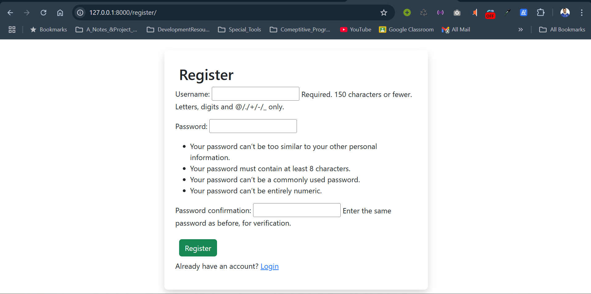
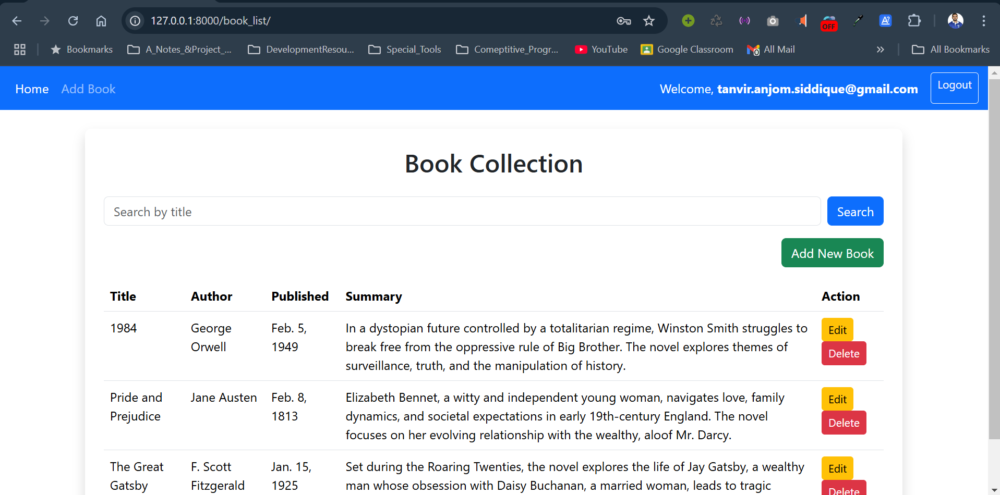
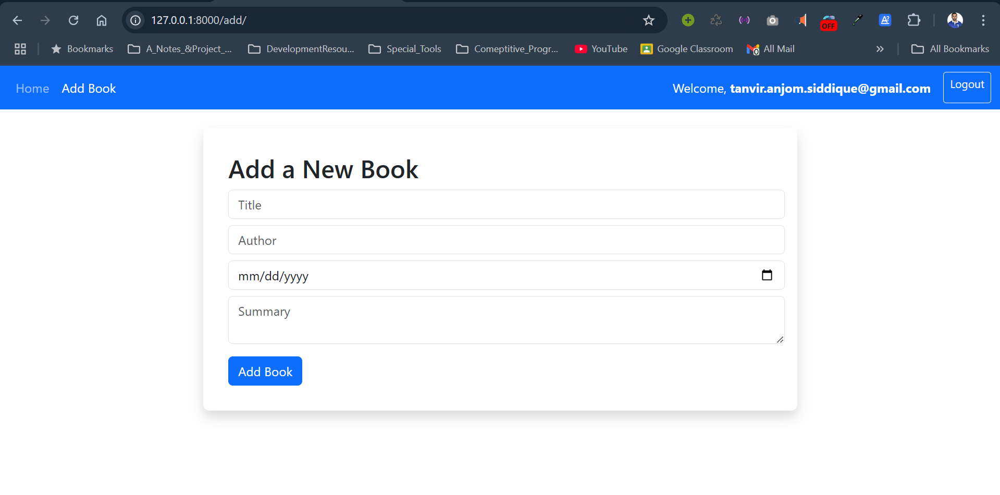
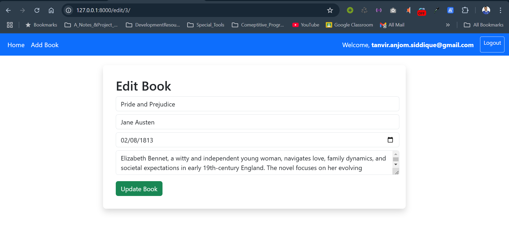

# Personal Book Collection Web Application (Django)

## Developed by:
[Tanvir Anjom Siddique](https://www.linkedin.com/in/tanvir-anjom-siddique/)

## Features
- Can Login & SignUp.
- There is form validation .
- Can handle multiple user.
- Can create, read, update, delete & filter books. 

## UI & UX

# Users in DB:
- username: tanvir.anjom.siddique@gmail.com ,pass: ruet1234
- username: tanvir ,pass: ruet1234
